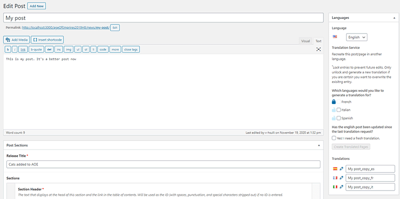

# AOE Translator: Automated Localization Platform
## Case Study: Xbox Game Studios — Enterprise Content Management

> *Note: Code patterns simplified for illustration. Implementation details reflect architectural decisions, not production code.*

---

## 🎯 Problem

### The Challenge
Age of Empires serves a **global audience** across dozens of languages. The editorial team faced a critical bottleneck:

- **Manual translation workflow** — every piece of content required hand-copying into translation forms
- **Complex content structures** — pages with 20+ custom fields, nested repeaters, flexible content blocks
- **Version control chaos** — translated pages easily fell out of sync with English source
- **Editorial overhead** — skilled writers spent hours on copy-paste instead of creating content

### Scale of the Problem
- **6+ supported languages** (Spanish, French, German, Portuguese, Italian, Korean, and more)
- **Hundreds of content pages** — news articles, patch notes, event announcements, tutorials
- **Weekly content cycles** — new announcements for game updates, esports, community events
- **ACF complexity** — Advanced Custom Fields with nested repeaters, flexible content, and WYSIWYG editors

---

## 🔧 Approach

### Solution Design
Build a **WordPress admin plugin** that:
1. Extracts all translatable content from any post (including complex ACF structures)
2. Sends content to Microsoft Azure Translator API in batch
3. Creates complete translated post variants via Polylang
4. Preserves content hierarchy, HTML formatting, and media references

### Automation Philosophy

```
┌─────────────────────────────────────────────────────────────────┐
│                    BEFORE: Manual Workflow                       │
│                                                                  │
│   English Post  →  Copy fields  →  Translate  →  Paste fields   │
│   Created          manually        externally     into new post  │
│                                                                  │
│   TIME: 30-60 minutes per language × 6 languages = 3-6 hours    │
└─────────────────────────────────────────────────────────────────┘

┌─────────────────────────────────────────────────────────────────┐
│                    AFTER: Automated Workflow                     │
│                                                                  │
│   English Post  →  Select languages  →  Click "Translate"       │
│   Created          (checkboxes)          (one button)           │
│                          │                                       │
│                          ▼                                       │
│              ┌─────────────────────┐                            │
│              │  AOE Translator      │                            │
│              │  • Extract content   │                            │
│              │  • Call Azure API    │                            │
│              │  • Create posts      │                            │
│              │  • Link via Polylang │                            │
│              └─────────────────────┘                            │
│                          │                                       │
│                          ▼                                       │
│   TIME: 2 minutes (automated) — editorial review only           │
└─────────────────────────────────────────────────────────────────┘
```

### Key Design Decisions

**1. Content Extraction Strategy**
- Parse WordPress post meta recursively
- Handle ACF field groups, repeaters, and flexible content
- Preserve array keys for accurate reconstruction
- Skip non-translatable fields (images, numbers, dates)

**2. Translation Locking System**
- Per-language lock state stored in post meta
- Prevents accidental overwrites of manually-edited translations
- Visual lock icons in admin UI
- One-click lock/unlock via AJAX

**3. Polylang Integration**
- Leverage existing language infrastructure
- Auto-create linked translations
- Preserve URL structure and language routing

---

## 🏗️ Architecture

### System Components

```
┌──────────────────────────────────────────────────────────────────┐
│                    AOE TRANSLATOR SYSTEM                         │
│                                                                  │
│  ┌─────────────┐    ┌─────────────┐    ┌─────────────┐          │
│  │  WORDPRESS  │    │  PLUGIN     │    │  AZURE      │          │
│  │  ADMIN UI   │    │  CORE       │    │  TRANSLATOR │          │
│  │             │    │             │    │             │          │
│  │ • Language  │───▶│ • Content   │───▶│ • REST API  │          │
│  │   Checkboxes│    │   Extract   │    │ • Batch     │          │
│  │ • Lock/     │    │ • JSON      │    │   Requests  │          │
│  │   Unlock    │    │   Serialize │    │ • HTML-     │          │
│  │ • Status    │    │ • Post      │    │   Aware     │          │
│  └─────────────┘    │   Create    │    └─────────────┘          │
│                     └─────────────┘                              │
│                            │                                     │
│                            ▼                                     │
│  ┌─────────────┐    ┌─────────────┐    ┌─────────────┐          │
│  │  POLYLANG   │◀───│  POST       │───▶│  ACF        │          │
│  │  LINKAGE    │    │  GENERATOR  │    │  FIELDS     │          │
│  │             │    │             │    │             │          │
│  │ • Language  │    │ • wp_insert │    │ • update_   │          │
│  │   Relations │    │   _post()   │    │   field()   │          │
│  │ • URL       │    │ • Meta copy │    │ • Nested    │          │
│  │   Routing   │    │ • Taxonomy  │    │   Support   │          │
│  └─────────────┘    └─────────────┘    └─────────────┘          │
└──────────────────────────────────────────────────────────────────┘
```

### WordPress Admin Integration

```php
// Hook into Polylang's translation widget
add_action('pll_before_post_translations', 'my_admin_translator_add_translate');

// Add Translation Service UI to every English post
function my_admin_translator_add_translate() {
    $pll_lang = pll_get_post_language($requested_post_id);
    if ($pll_lang == 'en') {
        // Render language checkboxes with lock states
        foreach ($languages as $lang_slug => $lang_name) {
            if ($lang_slug != 'en') {
                $locked = $should_lock[$lang_slug] ? 'locked' : '';
                echo '<div class="lock_content ' . $locked . '" data-lang="' . $lang_slug . '">';
                echo '<span class="icon"></span>';
                echo '<input type="checkbox" class="requested_lang" value="' . $lang_slug . '">';
                echo '<span>' . $lang_name . '</span>';
                echo '</div>';
            }
        }
    }
}
```

### Azure Translator API Integration

```javascript
// Batch translation with HTML preservation
const urlBase = '[internal-translation-api-endpoint]';

let request_data = {
  "RequestText": content_to_translate,
  "FromLanguage": "en",
  "ToLanguage": requested_languages.join(", "),  // "es, fr, de, pt"
  "HasHtml": true,  // Preserve HTML tags
  "isEdit": true,
  "SourceUrl": source_page_url
};

fetch(urlBase, {
  method: 'POST',
  headers: { 'Content-Type': 'application/json' },
  body: JSON.stringify(request_data),
})
.then(resp => resp.json())
.then(data => {
  // Response contains translations for each requested language
  // Rebuild post structure with translated content
  rebuildByLang(data.responseText);
});
```

### Translation Lock State Management

```
┌────────────────────────────────────────────────────────────────┐
│                    LOCK STATE FLOW                              │
│                                                                 │
│   Initial State: All languages UNLOCKED                         │
│   ┌─────────────────────────────────────────────────────────┐  │
│   │ post_meta['locked_translations'] = {                     │  │
│   │   'es': false, 'fr': false, 'de': false, ...            │  │
│   │ }                                                        │  │
│   └─────────────────────────────────────────────────────────┘  │
│                                                                 │
│   After Manual Edit: Editor locks Spanish                       │
│   ┌─────────────────────────────────────────────────────────┐  │
│   │ AJAX: lock_trans('isLock_es')                           │  │
│   │ post_meta['locked_translations']['es'] = true           │  │
│   │ UI: Spanish checkbox disabled, lock icon shown           │  │
│   └─────────────────────────────────────────────────────────┘  │
│                                                                 │
│   Re-translate Request: Only unlocked languages processed       │
│   ┌─────────────────────────────────────────────────────────┐  │
│   │ Spanish: SKIPPED (locked)                                │  │
│   │ French: TRANSLATED                                       │  │
│   │ German: TRANSLATED                                       │  │
│   └─────────────────────────────────────────────────────────┘  │
└────────────────────────────────────────────────────────────────┘
```

---

## 📊 Technical Highlights

### ACF Field Extraction

The most complex challenge was extracting translatable content from deeply nested ACF structures:

```php
// Recursive field extraction for flexible content layouts
$current_post_fields = get_fields($requested_post_id);

// Handle nested repeaters (e.g., sections → items → content)
foreach ($ltp_sections as $section) {
    if (!empty($section['map_group']['map_points'])) {
        foreach ($section['map_group']['map_points'] as $map_point) {
            $translatable_content[] = $map_point['map_point_label'];
            $translatable_content[] = $map_point['map_point_copy'];
        }
    }
}
```

### Post Creation Pipeline

```
Source Post (English)
        │
        ▼
┌───────────────────┐
│ Extract all meta  │  ← get_post_meta(), get_fields()
│ and ACF content   │
└───────┬───────────┘
        │
        ▼
┌───────────────────┐
│ Batch translate   │  ← Azure Translator API
│ via API           │
└───────┬───────────┘
        │
        ▼
┌───────────────────┐
│ Create new post   │  ← wp_insert_post() per language
│ per language      │
└───────┬───────────┘
        │
        ▼
┌───────────────────┐
│ Copy translated   │  ← update_post_meta(), update_field()
│ content to fields │
└───────┬───────────┘
        │
        ▼
┌───────────────────┐
│ Link via Polylang │  ← pll_set_post_language()
│                   │     pll_save_post_translations()
└───────────────────┘
```

---

## 🖼️ Screenshots

<!-- PLACEHOLDER: Admin UI showing translation service widget with language checkboxes -->


---

## 🎯 Results & Impact

### Workflow Transformation
| Metric | Before | After |
|--------|--------|-------|
| Time per translation | 30-60 min/language | ~2 min total |
| Languages per content piece | 6+ | 6+ (unchanged) |
| Editorial hours/week | 20+ hours | <2 hours |
| Human error rate | Frequent field mismatches | Zero (automated) |

### Business Value
- **Editorial capacity unlocked** — writers focus on content creation, not copy-paste
- **Faster time-to-market** — announcements reach global audiences simultaneously
- **Consistency** — machine translation provides uniform baseline quality
- **Flexibility** — lock system allows manual refinement without losing automation benefits

---

## 🛠️ Technology Stack

| Layer | Technologies |
|-------|-------------|
| Platform | WordPress 5.x, PHP 7.x |
| Plugin APIs | ACF (Advanced Custom Fields), Polylang |
| Translation | Azure Translator API (via internal wrapper) |
| Frontend | Vanilla JavaScript, jQuery, AJAX |
| Data | WordPress post meta, custom meta keys |

---

## 💡 Key Learnings

1. **Protect manual work** — the lock system was critical for editorial trust; without it, one accidental re-translate could wipe hours of human refinement

2. **Batch strategically** — sending all content in one API call (vs. per-field) reduced latency and API costs dramatically

3. **HTML-aware translation** — Azure's HTML preservation flag was essential; without it, WYSIWYG content would break

4. **Polylang is the source of truth** — building on existing infrastructure (rather than custom language routing) ensured compatibility with the broader WordPress ecosystem

5. **Show progress** — the success/failure notifications and per-language status indicators were essential for editorial confidence in an automated system
